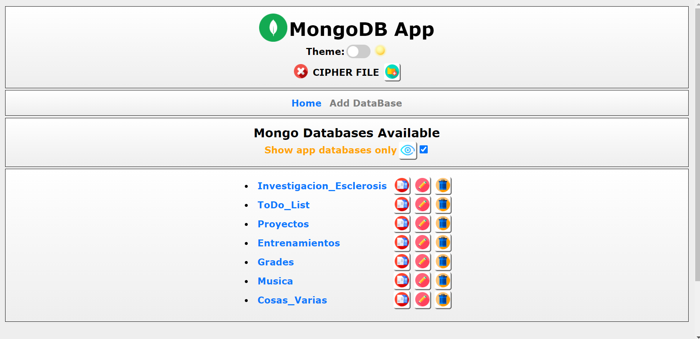

# MongoDB APP

Custom web app (made with python django framework) that creates a layer of abstraction between the user and the Mongo DB shell (like a Mongo Compass) but with special features like github connections and backup and restore options. It also has a command line interface to interact with the app. Bear in mind that this project is not finished (some code could be better written or is redundant and more features are planned to be added), but is completely functional.

## Installation
First of all, you need to create a .env file in the '/configs' directory with the following content
```
SECRET_KEY = '....your secret key ....'
```
Generate your django key here (https://djecrety.ir/) and paste it

- Option 1. If you are in windows, execute the installer.bat to add the program into PATH. To interact, type 'mongoapp' in a terminal.

- Option 2. Execute with python the file main.py (install all the external dependencies in the requirements.txt)

## How to Use
Manage your MongoDB with the web app interface

Home image Dark theme       |   Home image Light theme
:-------------------------:|:-------------------------:
 | 

See your database collections and documents
Collections       |   Documents
:-------------------------:|:-------------------------:
 | 

Update the model structure of the collection (defined when the collection was created)


Filter and sort your documents
Home image Dark theme       |   Home image Light theme
:-------------------------:|:-------------------------:
 | 

And some other functionalities for you to explore...
## Command Line Interface
```
 mongoapp <parameters> <flags> <options> [command] <parameters> <flags> <options> [command] ...

  => mongoapp --> allows to interact with the mongoapp
     - commands:
        => open --> opens the mongodb app in the explorer
        => start --> initializes the app server
        => launch --> initializes and opens the app
        => upload --> uploads the mongoapp to the github repository specified
           - options:
              => --create-task --> <HH:MM> schedules an automatic upload. By default the
                        task will be completed daily at the specified time
              => --show-task --> shows the created task information
              => --delete-task --> Deletes the task previously created
        => restore --> restores the last saved mongoapp state in the github repository
                  specified
        => register --> allows to interact with the configuration register of the app
           - commands:
              => rm --> <register_key> allows to remove a key of the register
              => clear --> Deletes every key of the register
                 - flags:
                    => -y --> doesn't ask for confirmation
              => show --> <void or register_keys> shows the information stored in the
                        register keys or all the register if a key is not specified
        => repo --> git repository to store the documents of the Mongo databases managed
                  by the app
           - commands:
              => add --> adds a git repository
              => rm --> removes the git repository
              => show --> shows the git repository configuration
           - options:
              => --user --> <github_user_name> allows to change the github user
              => --name --> <github_repo_name> allows to change the github repository name
              => --dir --> <dir_inside_github_repo> allows to change the directory of the
                        repository where the documents will be stored/downloaded from
        => clear --> deletes every database and info stored in the app
           - flags:
              => -y --> doesn't ask for confirmation
        => encrypt --> <data> encrypts data
           - options:
              => --with --> <password> encrypts the text deriving the key from the
                        password
        => decrypt --> <token> <key> decrypts data
           - options:
              => --derive --> <password> derives the password to obtain the key needed by
                        the algorithm to decrypt the token (encrypted data). If this
                        option is used, the second main argument 'key' is ignored
     - options:
        => --dir --> shows the directory where the app is located
        => --reveal --> reveals the app in the file explorer
        => --cmd --> opens a cmd in the app location directory
        => --uninstall-info --> shows info about the steps to follow in order to uninstall
                  and delete the app information in the current computer
        => --enable-autocomplete --> enables autocomplete in html forms
        => --disable-autocomplete --> disables autocomplete in html forms
```
